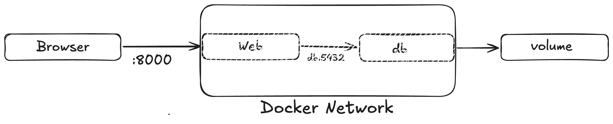

# Social Media API


REST API for a social media platform built with Django REST Framework.

Users can view and share posts, subscribe to each other, share stories and like posts

The API supports pagination, filtering, and sorting for all list endpoints


## Tech stack

- Python
- Django 5.x
- Django REST Framework
- PostgreSQL
- Docker + Docker compose
- pytest
- JWT (djangorestframework-simplejwt)


## How to run

### Prerequisites

* **Docker**
* **Docker compose**


### Running the Application

1. **Clone the repository:**

```bash
git clone https://github.com/ilybueface/SocialMediaApi
cd SocialMediaApi
```

2. **Configure the environment:**


Create a `.env` file in the root folder and add your keys there, following the example below:

```.env
POSTGRES_DB=social_media_db
POSTGRES_USER=postgres
POSTGRES_PASSWORD=postgres
```

3. **Build and launch containers**

```bash
docker compose up --build -d
```


## Running tests

**Running in a container that is already up**

If the project is already running via `docker compose up`, execute the following command in a separate terminal tab:
```bash
docker compose exec web pytest
```


## API Endpoints

| Method | Endpoint                     | Description                          |
|--------|------------------------------|--------------------------------------|
| POST   | /api/token/                  | Get JWT tokens                       |
| GET    | /backend/post/               | Get feed (posts from followed users) |
| POST   | /backend/post/               | Create post                          |
| POST   | /backend/post/{id}/like/     | Like a post                          |
| DELETE | /backend/post/{id}/unlike/   | Unlike a post                        |
| POST   | /backend/user/{id}/follow/   | Follow a user                        |
| DELETE | /backend/user/{id}/unfollow/ | Unfollow a user                      |
| GET    | /backend/post/{id}/comments/ | Get post comments                    |
| GET    | /backend/story/              | Active stories                       |


## Architecture

