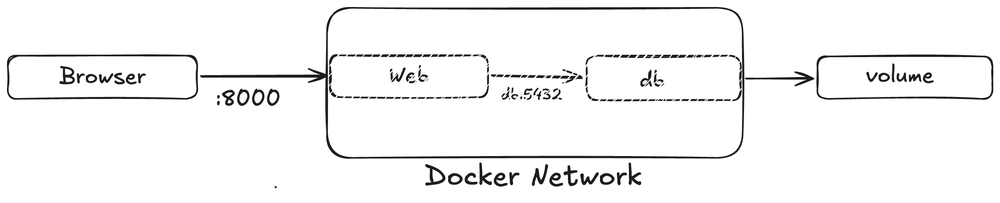

# Social Media API


[](https://github.com/ilybueface/SocialMediaApi/actions/workflows/deploy.yml)


REST API for a social media platform built with Django REST Framework.

Users can view and share posts, subscribe to each other, share stories and like posts

The API supports pagination, filtering, and sorting for all list endpoints


## Tech stack

- Python
- Django 5.x
- Django REST Framework
- Nginx
- GitHub Actions
- Aiogram 3.x
- PostgreSQL
- Docker + Docker compose
- pytest
- JWT (djangorestframework-simplejwt)


## How to run

### Prerequisites

* **Docker**
* **Docker compose**


### Running the Application

1. **Clone the repository:**

```bash
git clone https://github.com/ilybueface/SocialMediaApi
cd SocialMediaApi
```

2. **Configure the environment:**


Create a `.env` file in the root folder and add your keys there, following the example below:

```.env
POSTGRES_DB=social_media_db
POSTGRES_USER=postgres
POSTGRES_PASSWORD=postgres
POSTGRES_ENGINE=...
POSTGRES_PORT=...
SECRET_KEY=...
TELEGRAMM_KEY=(your telegram token)
TELEGRAMM_CHAT_ID=(your telegram id)
```

3. **Build and launch containers**

```bash
docker compose up --build -d
```


## Running tests

**Running in a container that is already up**

If the project is already running via `docker compose up`, execute the following command in a separate terminal tab:
```bash
docker compose exec web pytest
```

## Telegram Bot

An **asynchronous Telegram bot** built with the **Aiogram 3.x** framework is integrated into the project. Its primary purpose is to simplify DevOps routines by providing basic infrastructure monitoring tools directly within the messenger.

### Key Features:
* **Container Monitoring:** Using the `/status` command, the bot checks the Docker environment and displays the current state of the containers (e.g., `running` or `exited`).
* **Error Logging:** The bot automatically forwards logs with the **ERROR** severity level specifically caught during HTTP request processing (`django.request`). Manual errors logged outside the HTTP request lifecycle will not be sent to the chat.
* **Access Control (Custom Handler):** Access to the bot is strictly restricted. A custom authentication handler ensures that the bot only processes commands sent by the specific owner (validated against `TELEGRAMM_CHAT_ID`).

### Important Technical Considerations:
* The `/status` command displays **only** the container statuses within Docker. There is no web-level application check (HTTP health check).
* Mounting the Docker socket in read-only mode (`:ro`) restricts file system modifications but **does not** limit commands or requests sent to the Docker API.
* The system is designed strictly for basic `ERROR` log forwarding and container status viewing. It does not implement complex third-party infrastructure health monitoring or advanced secure access protocols.


## CI/CD & Deployment (GitHub Actions)

The project includes a complete Continuous Integration and Continuous Delivery (CI/CD) pipeline powered by **GitHub Actions**. This ensures code reliability and automates server updates.

### Workflow Breakdown:
* **CI Testing:** Every push or pull request automatically triggers the test pipeline. It sets up an isolated environment, configures the database, installs dependencies, and runs the entire test suite using `pytest`.
* **CD Deployment:** Once all tests pass successfully, GitHub Actions automatically deploys the latest changes to the remote production server, eliminating manual steps.
* **Environment Separation:** 
  * `docker-compose.yml` is optimized for local development and testing.
  * `docker-compose.prod.yml` is used for the production server. It is tailored for live deployment, running containers in the background (`-d`), managing the **Nginx** web server, and orchestrating production-ready service communication.


## API Endpoints

| Method | Endpoint                     | Description                          |
|--------|------------------------------|--------------------------------------|
| POST   | /api/token/                  | Get JWT tokens                       |
| GET    | /backend/post/               | Get feed (posts from followed users) |
| POST   | /backend/post/               | Create post                          |
| POST   | /backend/post/{id}/like/     | Like a post                          |
| DELETE | /backend/post/{id}/unlike/   | Unlike a post                        |
| POST   | /backend/user/{id}/follow/   | Follow a user                        |
| DELETE | /backend/user/{id}/unfollow/ | Unfollow a user                      |
| GET    | /backend/post/{id}/comments/ | Get post comments                    |
| GET    | /backend/story/              | Active stories                       |


## Architecture


